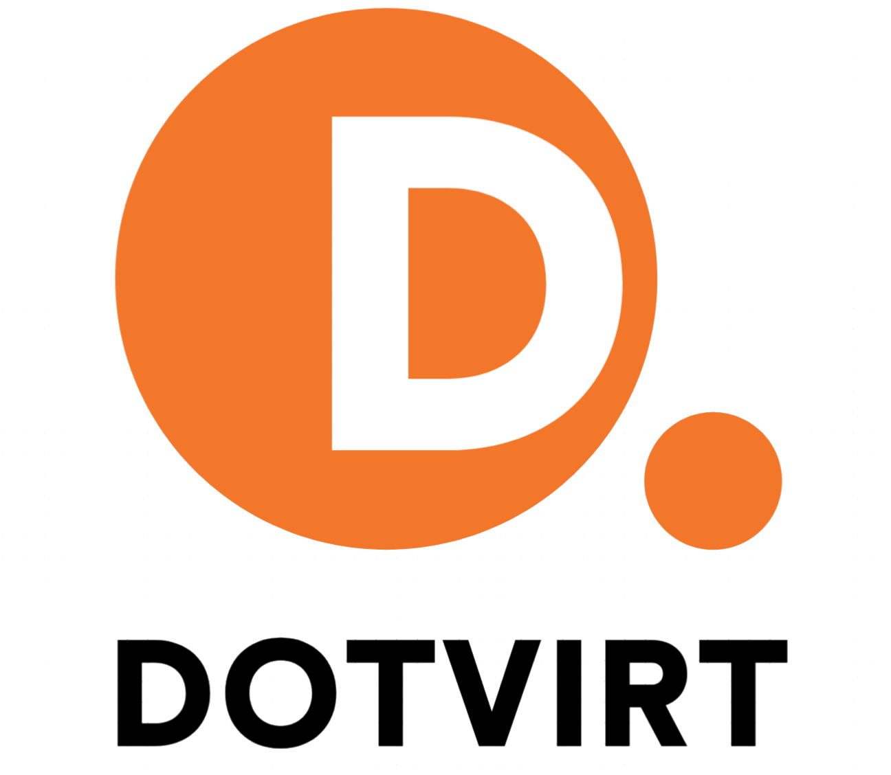

  

# dotvirt

A vCenter-like WebUI that closes the gap between point-and-click VM operation and
GitOps. dotvirt **edits git repos** of KubeVirt manifests and **works alongside
ArgoCD**. Argo stays the only thing that applies state to the cluster; dotvirt is
the friendly inventory + editor on top of git and Argo's status.

It is **multi-user and multi-tenant as a thin lens that owns nothing**: it rides
the cluster's own authentication and RBAC, and writes only git — every change lands
as a pull request a human (or policy) approves.

## How it fits together

- **dotvirt (the app)** — the WebUI + API. Reads the cluster, git, and Argo's status;
  proposes changes as PRs. Owns nothing, holds only a narrow clone/push token.
- **the installer operator** (`operator/`) — provisions a full dotvirt install from a
  single `Dotvirt` custom resource: the workload + Route/Ingress, RBAC, the ArgoCD
  AppProject tier + ApplicationSet, the platform git repo, and (optionally) a
  self-hosted Forgejo for evaluation. See [`operator/README.md`](operator/README.md).

## Prerequisites

- **ArgoCD** (OpenShift GitOps) and **KubeVirt** — hard prerequisites the operator
  never installs; it waits and reports if either is absent.
- **OVN-Kubernetes, NMState, and CDI** — soft: they unlock the networking tier and
  image upload. The install proceeds without them.

dotvirt runs on OpenShift (Route) and vanilla Kubernetes (Ingress) — the operator
detects the distribution and renders accordingly.

## Install

OLM from the self-hosted catalog: [`operator/install/README.md`](operator/install/README.md)
(release and dev-branch preview). Plain manifests / Helm on any cluster:
`make -C operator deploy`. See [`operator/README.md`](operator/README.md) for the
`Dotvirt` resource reference and [`CONTRIBUTING.md`](CONTRIBUTING.md) for releasing.

## License

Apache License 2.0 — see [`LICENSE.md`](LICENSE.md).
